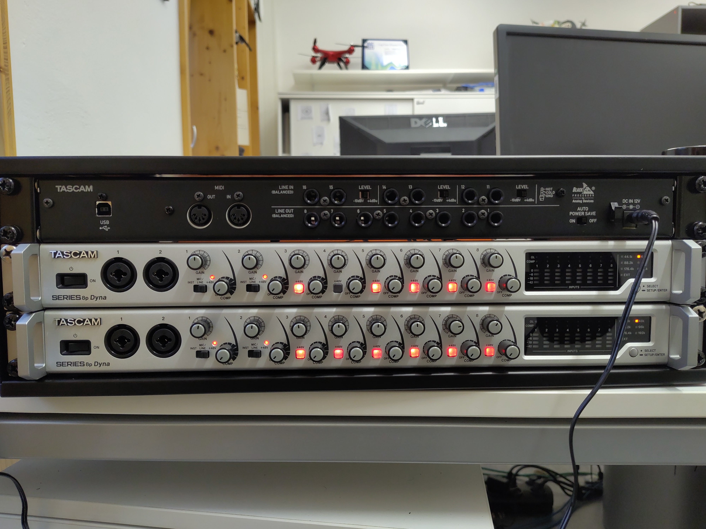
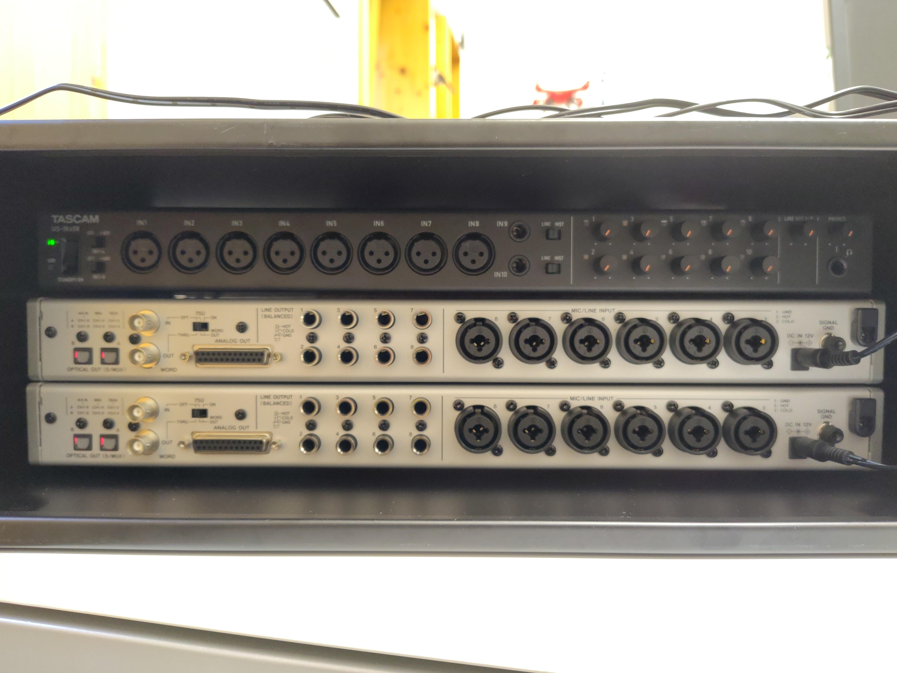
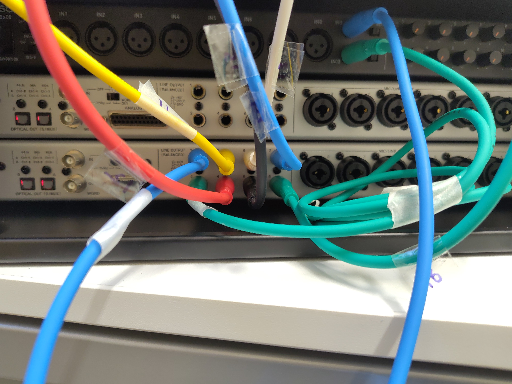
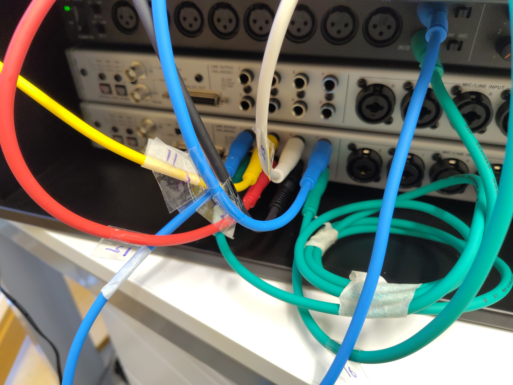

# User manual for the 16 channel recording system
This document describes the steps required to get the TASCAM 16x08 audio interface connected to a Windows laptop and the default settings required to make recordings.

## Powering up the recording system.
* The recording system consists of one 16 channel audio-interface (black colour, TASCAM 16x08) and two 8-channel microphone preamplifiers (silver, TASCAM Series 8p Dyna). 
* Remember that the preamps and audio-interface have different DC power-plugs! The devices should either be powered with the company-provided AC-DC adapters or with a 12V battery (cables attached). No other power source should be used. 
* After powering-up you should see the indicator lights turn on all the devices. 

## How all the switches need to be
The audio-interface and preamps have a lot of switches, and so here's a checklist of all the settings they need to be at.

### TASCAM 16x08 audio interface

Front-facing switches from left-right:
	* 'OFF/+48V' IN1-4 : at OFF
	* 'OFF/+48V' IN1-4 : at OFF
	* 'Line/Inst' : Line (BOTH switches the same)
	* Gain knobs from channels 1-10 on the lowest setting (indicator at 7 o' clock)

Back-facing switches from left to right:
	* Channels 16,15 'LEVEL': at +4dBu
	* Channels 14,13 'LEVEL': at +4dBu
	* Channels 12,11 'LEVEL': at +4dBu
	* AUTO POWER SAVE: at OFF

### TASCAM Series 8p Dyna (both devices with the same settings)
Front-facing switches left to right:
	* EXTREMELY IMPORTANT - COMP for all channels: always at OFF
	* Channel 1: Switch at '+48V'
	* Channel 2: Switch at '+48V'
	* All +48V 'clicked' - they should be red
	* Gain knobs -  could vary, but make sure to note all positions each time they are changed!

Back-facing switches:
	* the one switch in the back doesn't matter. It can be ignored for now.
	

### Channel connections
* Remember the preamps and the audio-interface face in opposite directions. 
* Connect 8 XLR-jack cables from preamp A to the first 8 inputs of the audio-interface. 
* Connect channels 9-10 with the Blue & Green jack-jack connectors (See the channel number label) in the front of the audio-interface
* Connect Channels 11-16 in the following order: Yellow (11), Red (12), White (13), Black (14), Blue (15), Green (16). (The order of the cables is based on the acronym of the rainbow-colours in english VIBGYOR - but with WHITE and BLACK at the end....so viBGYoR+W Bk, followed by Blue & Green to start again)

