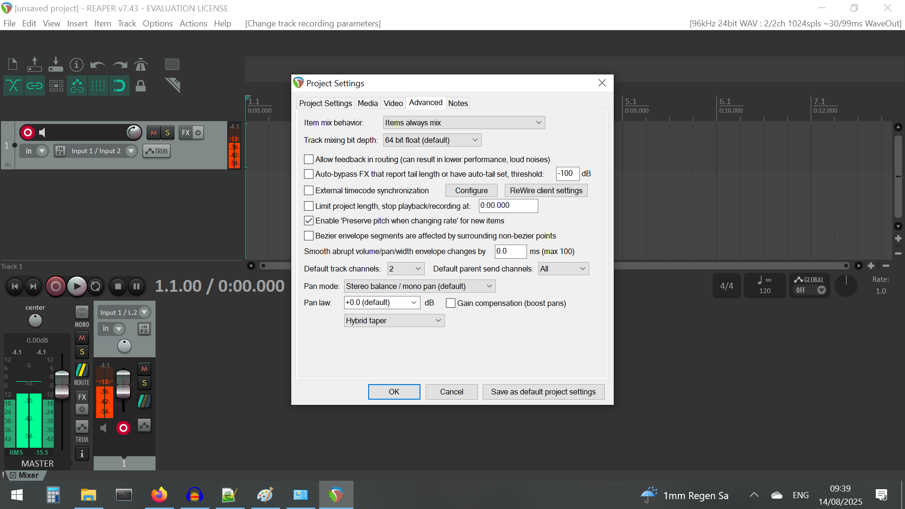
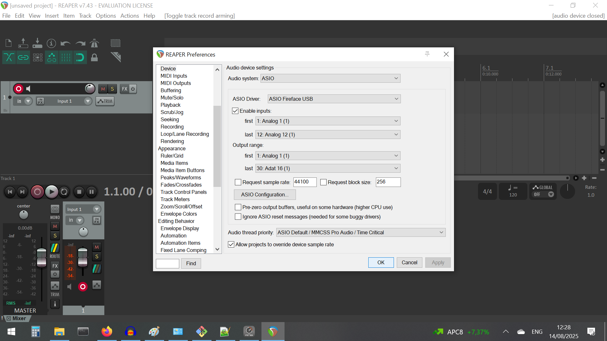
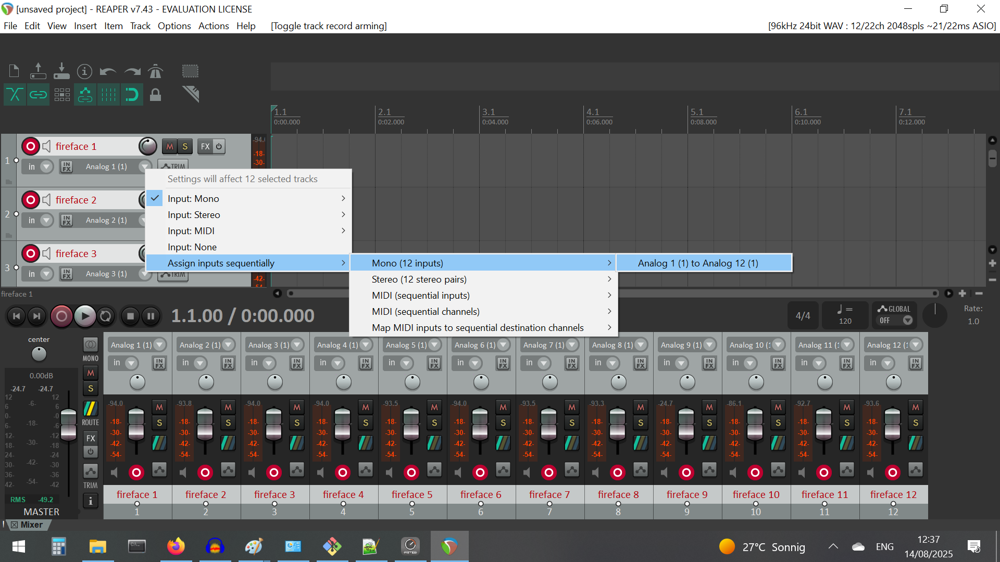

# The Python code doesn't work: BACKUP with REAPER
These instructions are for REAPER v7.43. *The screenshots show a Fireface USB device that has 12 channels. This is for testing & illustration purposes only*

* Check that the default OS sampling rate of the TASCAM is set to 96000 Hz (see the [software_setup](software_setup.md) document)
* Install REAPER [here](https://www.reaper.fm/download.php) - this provides a 60 day license (this will be figured out)
* Open REAPER (wait for the license prompt for ~10-15 seconds)
* File -> Project Settings -> and tick 'Project sample rate' and enter 96000 in the box, and 'Save as default project settings'

* By default REAPER will save to Documents/REAPER media/ as a WAV files. If you want to change the path go to the 'Media' tab in Settings and change 'Path to save...'
* Go to the 'Advanced' tab, 'Smooth abrupt volume/pan/width envelope changes by' - and set it to 0 ms. 
* Now click on 'Save as default project settings'



* Setting the audio device: at the top-right of the window (near the X to close the window), there should be some info about sample rate, bit depth etc. Click on it, and you'll get the Preferences menu. 
	* If possible:
		* Audio system: ASIO
		* ASIO driver: ASIO TASCAM (or some such thing)
		* Enable inputs: first: Analog (1), last: Analog(16)
		* Tick 'Request sample rate' and set it to 96000, 'Request block size': 2048
	* Click on OK to save these parameters


* First insert 'tracks'. In REAPER, tracks are used to record audio from various sources. Do this with: 'Insert' -> 'Multiple tracks' 
* In the new window 'Insert how many tracks' enter 16, with the Named field up to you

* Click on one of the tracks (top-left section), and choose all 16 tracks with Ctrl+A
* Activate or 'arm' all tracks by clicking on the red button on the left. 

* Now assign one track to one channel of the audio interface. Click on the drop-down menu with a name that says something like 'Analog 1(1)' -> Assign inputs sequentially -> Mono (16) inputs -> Analog 1 to Analog 16. Now each track corresponds to one channel of the device


### Starting a recording 
* First, check that all mics are working with a clap or so. You should see the level change in the REAPER level window (bottom panel) and also on the TASCAM mixer window

* To start recording press Ctrl+R and the spacebar to stop recording. The clips are automatically saved in the previously set output folder.
	* The files are saved with the start time in <tracknumber>_YYMMDD_hhmm-<takenumber>.wav format. I think the hour and minute correspond to the start time, but I'm not fully sure right now
* You can save multiple files over and over with Ctrl+R and spacebar, but it's 'cleaner' if you move the time-line start-point to the right after every recording. You'll get 16 WAV files corresponding to each manual trigger. 

### Coming back to the same settings

* You can come back to the same settings in REAPER by saving the current project File -> Save Project, or also making a project template File -> Project template -> Save project template. 

### Keyboard shortcuts (some old and some new)

* Select all tracks, mouse-click on one track and then ```Ctrl + A```
* REcord: ```Ctrl + R``` 
* Stop recording: ```space bar```
* Open track level-monitoring : ```Ctrl + M```