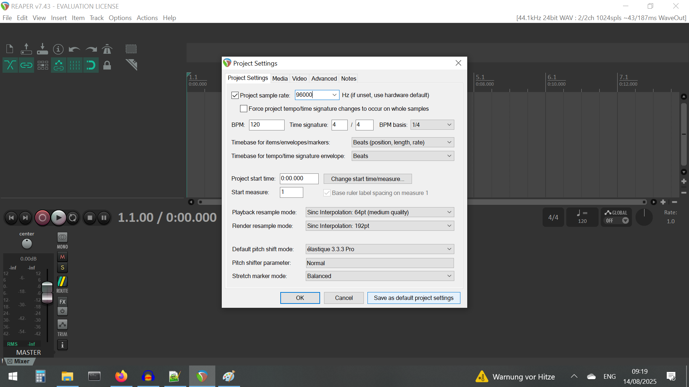
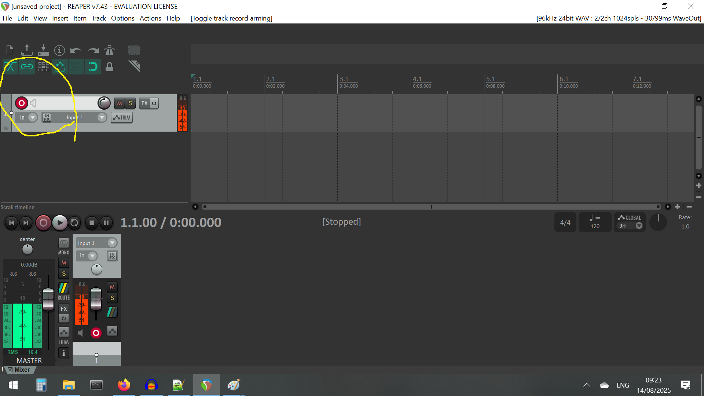

# The Python code doesn't work: BACKUP with REAPER
These instructions are for REAPER v7.43. 

* Check that the default sampling rate of the TASCAM is set to 96000 Hz (see the [software_setup](software_setup.md) document)
* Install REAPER [here](https://www.reaper.fm/download.php) - this provides a 60 day license (this will be figured out)
* File -> Project Settings -> and tick 'Project sample rate' and enter 96000 in the box, and 'Save as default project settings'

* Another thing to check is in the 'Advanced' tab, 'Smooth abrupt volume/pan/width envelope changes by' - and set it to 0 ms. 

* First insert a track - this will allow you to record audio. Do this with: 'Insert' -> 'Track'. 
* Go to track #1 and click on the red 'button' on the top left part of the window to 'arm' (REAPER terminology for activation) the track. 

* Choose your input device (US-16x08, or whatever appears that corresponds to the TASCAM recorder)
* To start recording press the other 'red button' in the middle, and the stop icon (square) to stop recording. The clips are automatically saved in the 'REAPER media' file, probably in the 'Documents' folder. The files are saved with the start time in <tracknumber>_YYMMDD_hhmm-<takenumber>.wav format. I think the hour and minute correspond to the start time, but I'm not fully sure right now
	* You can also change the destination in 'File' -> 'Project Settings' -> 'Media' tab	-> 'Path to save media files'
