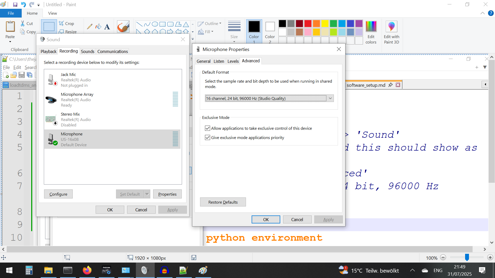
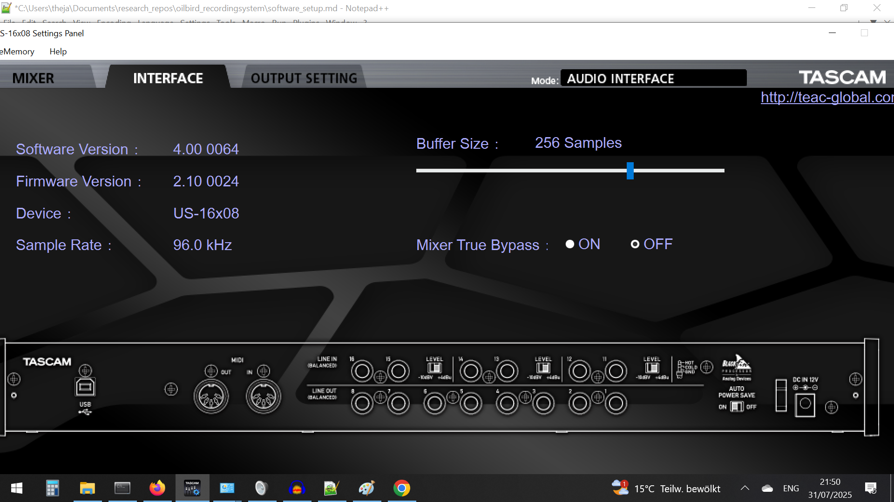

# Software setup for recordings

## Installing the TASCAM 16x08 drivers 

* Install Tascam windows driver and settings panel software: https://tascam.jp/downloads/products/tascam/us-16x08/us-16x08_settingspanel_v400_win.zip

* Every time you connect the 16x08's USB to the laptop the TASCAM interface program should pop-up. If it doesn't pop up, the 16x08 hasn't been registered, and you need to either re-insert the USB or restart the computer. 

## ASIO4ALL...? (to be decided...)

## IMPORTANT: Change the default sampling rate in Windows
* Go to 'Control Panel' -> 'Hardware & Sound' -> 'Sound' 
* Choose 'Microphone' with 'US-16x08' on it, and this should show as the default device
* Go to 'Properties' for the US-16x08 -> 'Advanced' 
* Change the 'Default format' to '16 channel, 24 bit, 96000 Hz (Studio Quality)



You should see the 'sample rate' change to 96 kHz:



## Installing conda and a python environment
* Install conda : https://www.anaconda.com/docs/getting-started/miniconda/main

* Open up 'Command Prompt' in Windows.
* Create a new environment with ```conda create -n oilbirdrec python==3.11.0```
* Activate the conda environment with ```conda activate oilbirdrec```
* Change your current directory to 'oilbird_recordingsystem' using ```cd```
* Install the packages needed to run the code with ```pip install -r requirements.txt``` 
* Connect a mic. Start a recording with the default parameters with ```python manual_recording.py``` and inspect the recorded audio with Audacity to see if you pick up any audio on the correct channel. 